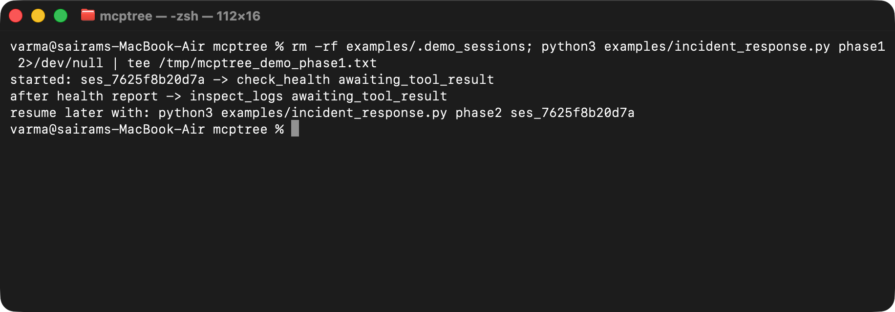
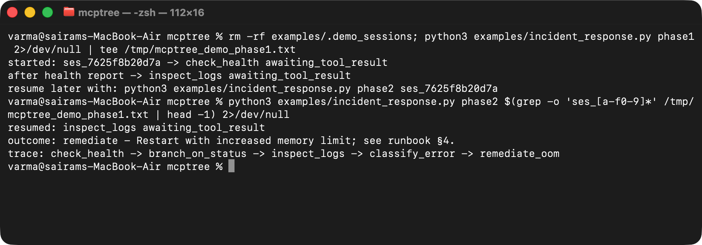
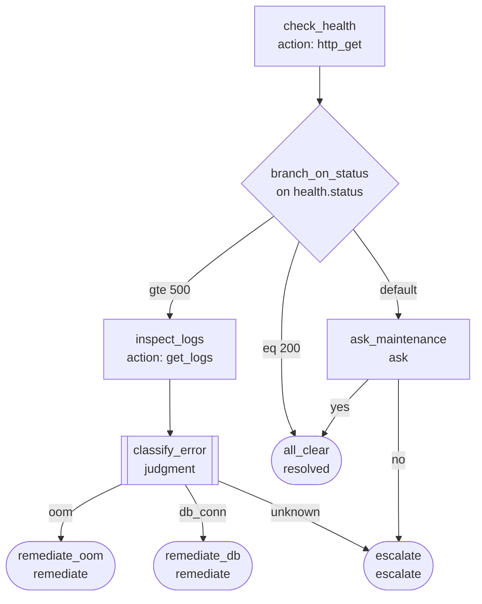

# mcptree

[](https://github.com/varmabudharaju/mcptree/actions/workflows/ci.yml)
[](LICENSE)


**FastMCP made tools easy. mcptree makes decisions declarative.**

MCP gives servers tools, resources, prompts, and elicitation — but no primitive
for *branching logic*. If you want an agent to follow a runbook, a triage flow,
or an escalation checklist, today you either bake the logic into a giant system
prompt (the agent may skip a step, or hallucinate one) or hand-write a state
machine per server. mcptree is a small open protocol plus a FastMCP-style
framework for publishing that logic as data: a YAML decision tree that a
built-in engine walks deterministically, consulting the agent only where the
outside world — a tool result, a human answer, a genuine judgment call — is
actually needed.

The division of labor: **the agent does the acting, the tree does the
deciding.** Every step is recorded in an append-only trace, so "why did the
agent escalate this?" always has an answer.

One honest boundary: the engine is deterministic *given reported inputs*. Tool
results are reported by the agent, not observed by the server — the trace records
what was reported and through which channel (elicited human answers are marked
`source: "elicitation"`), so it is testimony you can audit, not surveillance.

- [`SPEC.md`](SPEC.md) — the normative wire protocol (v0.1), for anyone
  implementing a conforming server or client in any language.
- [`docs/use-case.md`](docs/use-case.md) — a captioned walkthrough of the
  incident tree below, call by call, with real envelope JSON.

## See it work

[`examples/incident_response.py`](examples/incident_response.py) is a real
two-process crash-proof-resume demo: each phase spawns its own `mcptree serve`
stdio subprocess, sharing nothing but the sessions directory on disk. Process 1
starts the tree and reports a failing health check; process 2 — a brand-new OS
process run later — resumes the exact same session by id, reports the logs,
makes the judgment call, and reaches `outcome: remediate` with the full audit
trace. Real terminal output, no mocking:





Run it yourself: `python3 examples/incident_response.py phase1`, then in a
*separate* invocation `python3 examples/incident_response.py phase2 <session_id>`
(the first phase prints the exact command). More shots — `mcptree validate` and
`mcptree viz` — are in [`docs/test-evidence.md`](docs/test-evidence.md).

## Quickstart A — mount onto an existing FastMCP server

One line adds the whole protocol (five tools, session persistence, an audit
trail) to any FastMCP server you already have:

```python
from fastmcp import FastMCP
from mcptree import DecisionTrees

mcp = FastMCP("incident-bot")
DecisionTrees(mcp, "trees/")   # mounts tools, sessions, audit trail
```

## Quickstart B — instant server from a directory of trees

mcptree isn't published to PyPI yet — install from source, from a checkout of
this repo:

```bash
pip install -e .
mcptree serve trees/
```

Other CLI commands:

```bash
mcptree validate trees/       # lint trees in CI — node-level errors
mcptree viz trees/incident.yaml   # render a tree as a mermaid diagram
```

## The flagship tree

`trees/incident.yaml` is a production-incident triage runbook exercising all
five node types (abridged and annotated below — the unmodified file is in the
repo at `trees/incident.yaml`, and appears verbatim in `SPEC.md`):

```yaml
mcptree: "0.1"
id: incident-triage
title: Production incident triage
entry: check_health

nodes:
  check_health:
    type: action                    # instruct the agent to call a tool it has
    tool: http_get
    args: { url: "https://api.example.com/health" }
    result: { capture: health }     # reported result stored into session facts
    next: branch_on_status

  branch_on_status:
    type: condition                 # pure data branch — engine-evaluated, no round trip
    on: health.status               # fact path
    branches:
      - when: { eq: 200 }
        then: all_clear
      - when: { gte: 500 }
        then: inspect_logs
    default: ask_maintenance        # v0.1: every condition node requires a default

  classify_error:
    type: judgment                  # the ONLY place the model decides, and only among declared options
    prompt: Classify the dominant error in the logs.
    evidence: [logs]
    options:
      - { id: oom,     then: remediate_oom }
      - { id: db_conn, then: remediate_db }
      - { id: unknown, then: escalate }
    require_rationale: true         # rationale recorded in the trace

  all_clear:
    type: terminal
    outcome: resolved
    summary: "Service healthy; no action required."

  # ... inspect_logs, ask_maintenance, remediate_oom, remediate_db, escalate
  # in trees/incident.yaml
```

Rendered with `mcptree viz trees/incident.yaml` (real output, pasted verbatim):



## An envelope walk

Every `tree_start`/`tree_answer`/`tree_status` call returns one self-describing
JSON "step envelope" — an agent that lost all context can call `tree_status`
and keep going correctly, with no prompt memory required. Three real calls
against `trees/incident.yaml` (`session_id` and timestamps are from an actual
run; see [`docs/use-case.md`](docs/use-case.md) for the full walk through to a
terminal outcome):

**1. `tree_start("incident-triage")`** — first node is an `action`:

```json
{
  "session_id": "ses_23d02c087aca",
  "tree_id": "incident-triage",
  "node": "check_health",
  "step": 1,
  "error": null,
  "outcome": null,
  "evidence": {},
  "state": "awaiting_tool_result",
  "instruction": "Call tool `http_get` with the args in `expects.args`, then report its result via tree_answer (set is_error=true if the call failed).",
  "expects": {
    "kind": "tool_result",
    "tool": "http_get",
    "args": { "url": "https://api.example.com/health" },
    "schema": null
  }
}
```

**2. `tree_answer(session_id, step=1, value={"status": 503})`** — the engine
auto-advances through `branch_on_status` (a `condition` node, no round trip)
straight to the next `action`:

```json
{
  "session_id": "ses_23d02c087aca",
  "tree_id": "incident-triage",
  "node": "inspect_logs",
  "step": 2,
  "error": null,
  "outcome": null,
  "evidence": {},
  "state": "awaiting_tool_result",
  "instruction": "Call tool `get_logs` with the args in `expects.args`, then report its result via tree_answer (set is_error=true if the call failed).",
  "expects": {
    "kind": "tool_result",
    "tool": "get_logs",
    "args": { "service": "api", "lines": 200 },
    "schema": null
  }
}
```

**3. `tree_answer(session_id, step=2, value={"lines": ["java.lang.OutOfMemoryError: heap"]})`**
— lands on the `judgment` node, with the captured logs surfaced as `evidence`:

```json
{
  "session_id": "ses_23d02c087aca",
  "tree_id": "incident-triage",
  "node": "classify_error",
  "step": 3,
  "error": null,
  "outcome": null,
  "evidence": { "logs": { "lines": ["java.lang.OutOfMemoryError: heap"] } },
  "state": "awaiting_judgment",
  "instruction": "Classify the dominant error in the logs.",
  "expects": {
    "kind": "enum",
    "options": ["oom", "db_conn", "unknown"],
    "require_rationale": true
  }
}
```

From here, `tree_answer(session_id, step=3, value="oom", rationale="OutOfMemoryError in captured logs")`
lands on the `remediate_oom` terminal node with `state: "done"` and
`outcome: "remediate"` — see [`docs/use-case.md`](docs/use-case.md) for that
step and the full audit trace.

## Status

v0.1. Python 3.11+, MIT licensed. Runtime dependencies: `fastmcp` and `pyyaml`.
56 tests passing (`python3 -m pytest`). See [`SPEC.md`](SPEC.md) for the full
protocol and [`docs/use-case.md`](docs/use-case.md) for the end-to-end walk.
