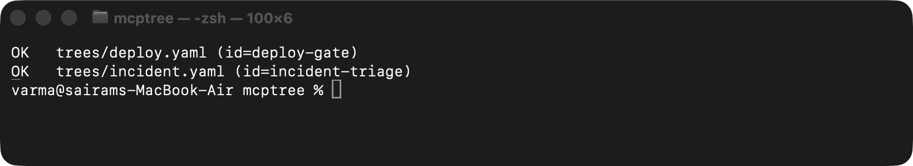
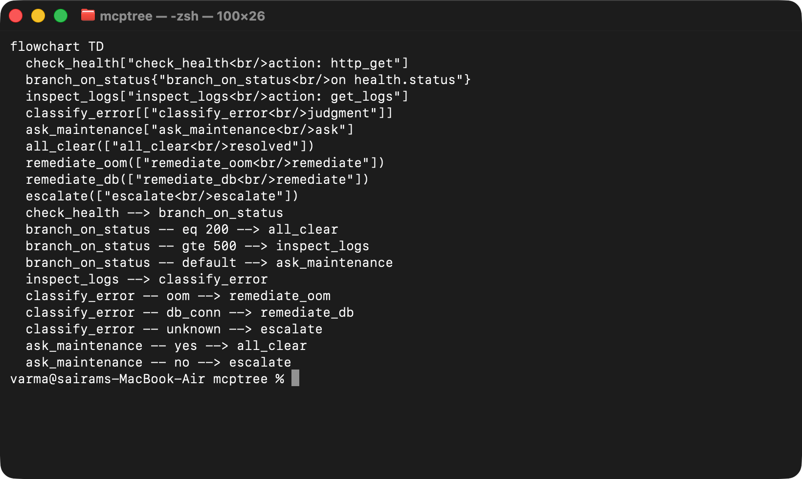
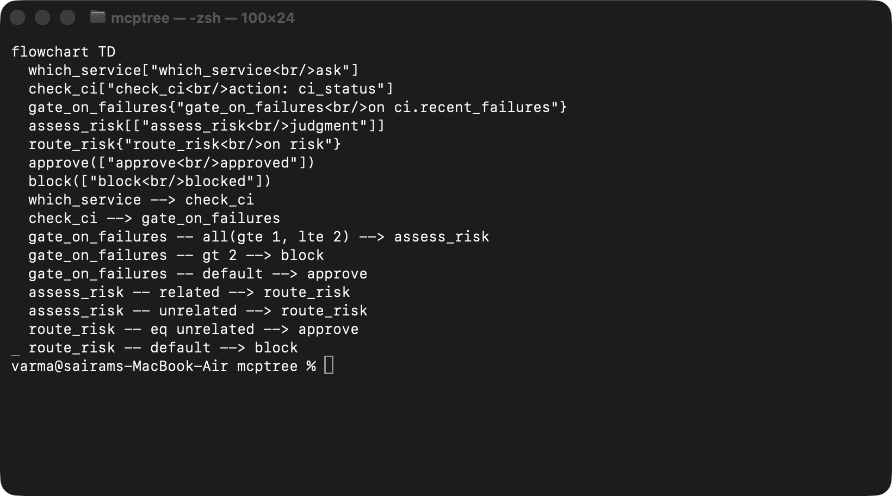
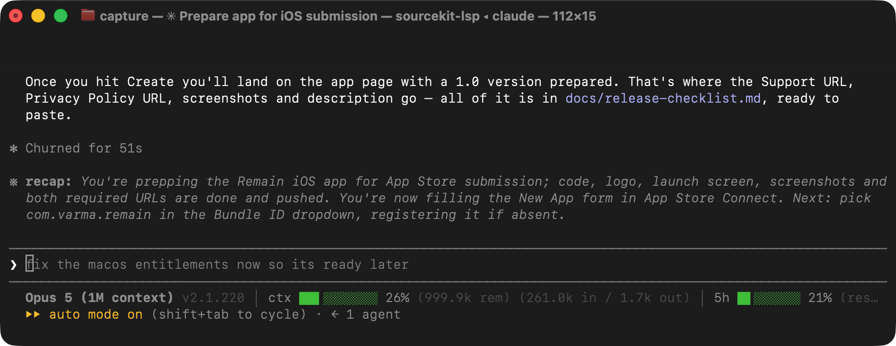
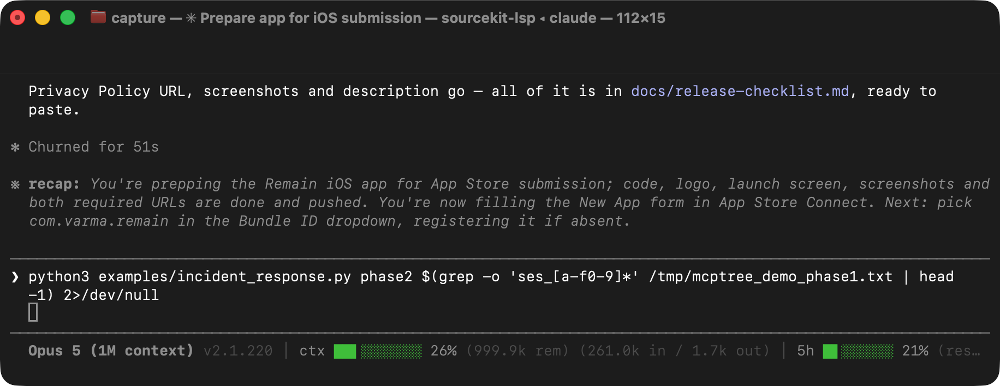

# mcptree — test evidence

_Generated 2026-07-24T02:49:37Z._

<!-- shotlist:start -->
### Mcptree Validate

mcptree validate trees/ — lints every tree in the directory (node types, required fields, dangling refs, 0.2 placeholder lint); both the 0.1 incident-triage tree and the 0.2 deploy-gate tree pass.

`mcptree validate trees/`

### Mcptree Viz

mcptree viz trees/incident.yaml — the incident-triage tree rendered as a Mermaid flowchart: all five node types (action, condition, judgment, ask, terminal) and branch labels, generated straight from the YAML.

`mcptree viz trees/incident.yaml`

### Mcptree Viz Deploy

mcptree viz trees/deploy.yaml — the 0.2 deploy-gate tree rendered as a Mermaid flowchart: the interpolated ci_status action, the all-composite failure band on the condition, and the captured judgment (risk) feeding the route_risk condition.

`mcptree viz trees/deploy.yaml`

### Demo Phase1 Start

Process 1 (phase1) — a fresh OS process: tree_start opens a session on incident-triage, tree_answer reports a 503 health check and the engine auto-advances past the pure-data condition node straight to inspect_logs, then the process exits. The session lives only on disk from here.

`rm -rf examples/.demo_sessions; python3 examples/incident_response.py phase1 2>/dev/null | tee /tmp/mcptree_demo_phase1.txt`

### Demo Phase2 Resume

Process 2 (phase2) — a brand-new OS process, sharing nothing with phase1 but the sessions directory: tree_status resumes the same session_id at inspect_logs, tree_answer reports OOM logs then the judgment classification, landing on outcome: remediate. tree_trace prints the full audit path from check_health to remediate_oom — real crash-proof resume, not a mock.

`python3 examples/incident_response.py phase2 $(grep -o 'ses_[a-f0-9]*' /tmp/mcptree_demo_phase1.txt | head -1) 2>/dev/null`

<!-- shotlist:end -->
